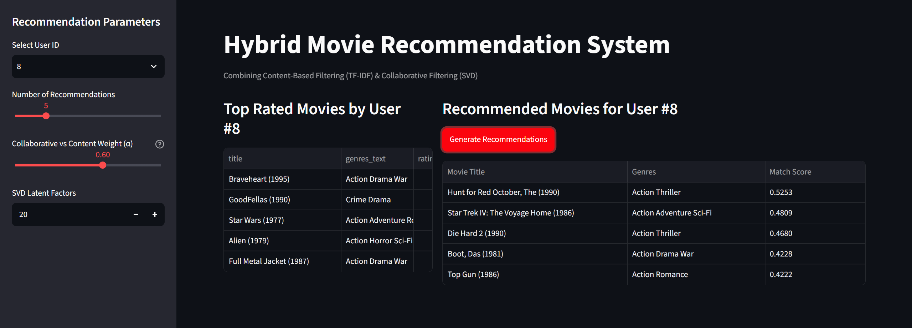

# 🎬 Hybrid Movie Recommendation System

A production-grade Hybrid Movie Recommendation System built with Python, FastAPI, and Streamlit using the MovieLens 100K dataset. The system combines **Content-Based Filtering (TF-IDF)** and **Collaborative Filtering (SVD Matrix Factorization)** to deliver personalized movie recommendations.

---

## Project Architecture

```text
movie-recommendation-system/
├── README.md
├── requirements.txt
├── Dockerfile
├── data/
│   ├── raw/
│   │   └── ml-100k/            # MovieLens 100K raw dataset (u.data, u.item)
│   └── processed/
├── docs/
│   └── architecture.png        # System flow diagram
├── notebooks/
│   ├── 01_eda_and_exploration.ipynb
│   ├── 02_content_based_prototype.ipynb
│   └── 03_collaborative_prototype.ipynb
├── src/
│   ├── __init__.py
│   ├── data/
│   │   ├── __init__.py
│   │   └── loader.py           # Robust pure-Python file loader pipeline
│   ├── models/
│   │   ├── __init__.py
│   │   ├── content_based.py    # TF-IDF + Cosine Similarity engine
│   │   ├── collaborative.py    # SVD Matrix Factorization engine
│   │   └── hybrid.py           # Weighted Ensemble Recommender
│   └── utils/
│       ├── __init__.py
│       └── metrics.py          # RMSE, Precision@K, Recall@K evaluation
└── app/
    ├── __init__.py
    ├── main.py                 # FastAPI Web API
    └── ui.py                   # Interactive Streamlit Web Interface

```


⚙️ How It WorksThe recommendation pipeline uses a hybrid formula combining content similarity with collaborative user preference scores:$$\text{Final Score} = \alpha \cdot \text{Score}_{\text{Collaborative}} + (1 - \alpha) \cdot \text{Score}_{\text{Content}}$$Content-Based Engine (src/models/content_based.py): Vectorizes movie genre text metadata using TfidfVectorizer and computes pairwise cosine similarity matrices across items.Collaborative Engine (src/models/collaborative.py): Performs Singular Value Decomposition (scipy.sparse.linalg.svds) on normalized User-Item rating matrices to infer latent user preferences.Hybrid Engine (src/models/hybrid.py): Scales collaborative predictions into $[0, 1]$ via MinMaxScaler, computes average user content profiles based on highly rated titles, and generates a weighted composite rank.


<p align="center">
  <br>
  <sub><b>Figure 1:</b> Visual representation of movie recommendation system</sub>
</p>